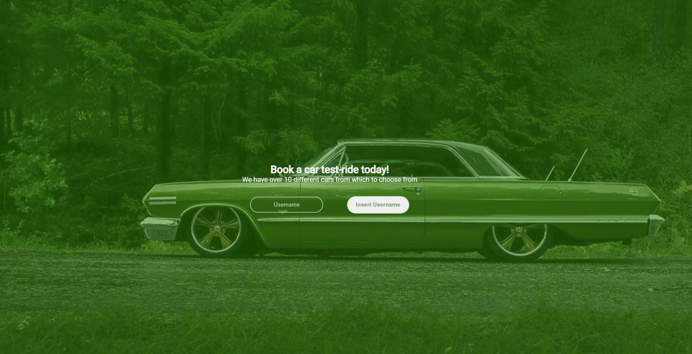

# Final-Capstone Front-End

> This is the front end of Microverse's final capstone

## Screenshot

## Built With

- React

## Getting Started

To get a local copy up and running follow these simple example steps.

### Prerequisites

- npm

### Setup

- Make sure you have npm set up

### Install

- Run npm i

### Usage

- Run npm run start

### Tests

- Run npm test

### Deployment

- The front-end can be deployed following the get started section on netlify

## Author

👤 **Leonardo Paz**

- Github: [Leonardo Paz](https://github.com/leolpaz)
- Linkedin: [Leonardo Paz](https://www.linkedin.com/in/leonardolpaz/)

👤 **Hichami Houssam**

- GitHub: [@redwing555](https://github.com/redwing555/)

👤 **Isai Cespedes**

- GitHub: [@Lordkaito_](https://github.com/Lordkaito)
- LinkedIn: [LinkedIn](https://linkedin.com/in/isaicespedes)

👤 **Cyril Iyadi**

- GitHub: [@see-why](https://github.com/see-why)
- LinkedIn: [C.Iyadi](https://www.linkedin.com/in/cyril-iyadi/)

## 🤝 Contributing

Contributions, issues, and feature requests are welcome!

Feel free to check the [issues page](../../issues/).

## Show your support

Give a ⭐️ if you like this project!

## Acknowledgments

- [Murat Korkmaz](https://www.behance.net/muratk) for the [design](https://www.behance.net/gallery/26425031/Vespa-Responsive-Redesign)

## 📝 License

This project is [MIT](./MIT.md) licensed.
